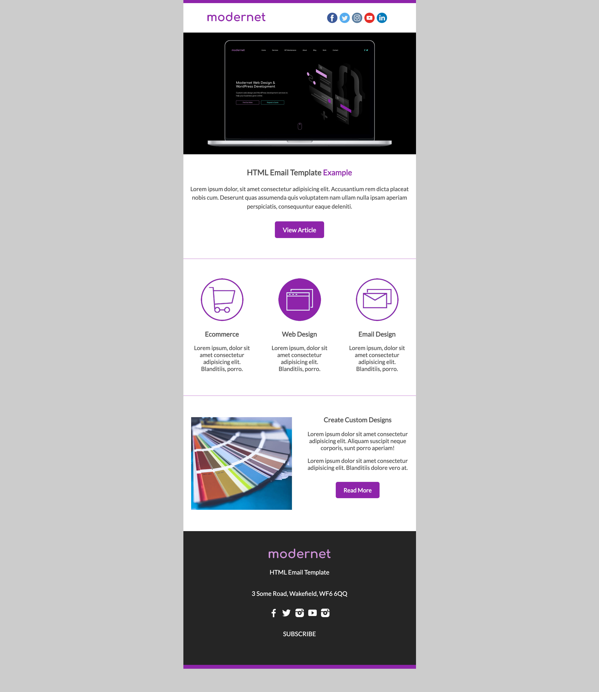
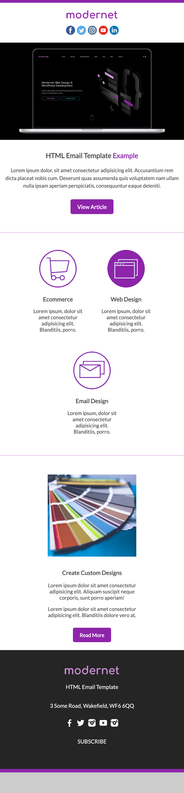
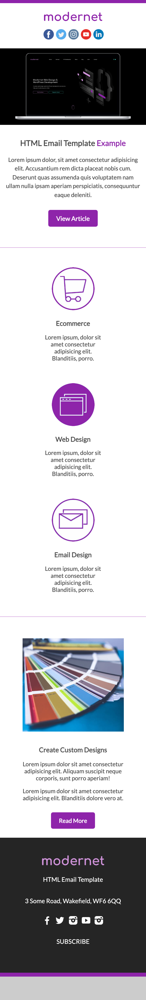

# Example HTML Email

A basic example of a responsive HTML email, images should be stored remotely with a site such as https://cloudinary.com/ and all css styles should be converted to inline styles, https://templates.mailchimp.com/resources/inline-css/ has a cool tool that will do this for you. See the responsive screenshots below.

### 3 Column Layout

### 2 Column Layout

### Single Column Layout
